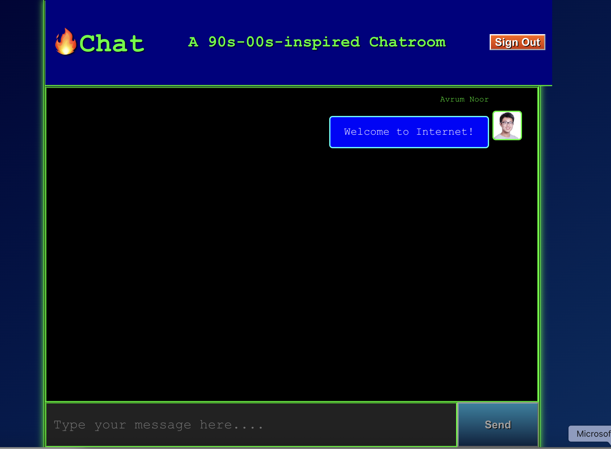

# 🔥 FyreChat

A retro-inspired, Firebase-powered chatroom app built with **React** and styled to resemble the nostalgic aesthetics of late 90s/early 2000s tech — featuring retro-futuristic UI elements and neon green terminal fonts. ✨

 <!-- Add a screenshot of your app in the repo -->

## 🚀 Features

- 🔐 Google Authentication using Firebase Auth
- 💬 Real-time messaging powered by Firebase Firestore
- 📷 Displays user avatars and usernames
- 🎨 Nostalgic styling inspired by early internet chatrooms and retro Apple/macOS UI
- 📱 Fully responsive layout

---

## 🧰 Tech Stack

| Technology        | Purpose                              |
|------------------|--------------------------------------|
| **React**         | UI framework                         |
| **Firebase**      | Backend (Auth, Firestore, Analytics) |
| **react-firebase-hooks** | Simplified real-time listeners   |
| **CSS**           | Retro skeuomorphic + terminal theme |

---

## 📦 Installation & Setup

### 1. Clone the repository

```bash
git clone https://github.com/avrumnoor/fyrechat.git
cd fyrechat
```

### 2. Install dependencies

```bash
npm install
```

### 3. Set up Firebase

1. Go to [Firebase Console](https://console.firebase.google.com/)
2. Create a new project
3. Enable **Authentication** (Google Sign-In method)
4. Create a **Firestore Database** in test mode (start with “Start in test mode”)
5. Add a **Web App** to your Firebase project
6. Replace the Firebase config in `src/App.js` with your credentials:

```js
const app = initializeApp({
  apiKey: "YOUR_API_KEY",
  authDomain: "YOUR_PROJECT.firebaseapp.com",
  projectId: "YOUR_PROJECT_ID",
  storageBucket: "YOUR_PROJECT.appspot.com",
  messagingSenderId: "SENDER_ID",
  appId: "YOUR_APP_ID",
  measurementId: "YOUR_MEASUREMENT_ID"
});
```

### 4. Configure Firestore Rules

> Required to allow authenticated users to read/write messages:

```js
rules_version = '2';
service cloud.firestore {
  match /databases/{database}/documents {
    match /messages/{message} {
      allow read, write: if request.auth != null;
    }
  }
}
```

### 5. Start the development server

```bash
npm start
```

This will open the app at [http://localhost:3000](http://localhost:3000)

---

## 🧪 Folder Structure

```
fyrechat/
├── public/
├── src/
│   ├── App.js
│   ├── App.css
│   └── index.js
├── .gitignore
├── package.json
└── README.md
```

---

## 🛠️ Available Scripts

In the project directory, you can run:

- `npm start` – Runs the app in development mode
- `npm run build` – Builds the app for production
- `npm test` – Runs test suite (if added)
- `npm run lint` – Lint your code (if ESLint is added)

---

## 🌍 Deployment

To deploy your app with Firebase Hosting:

```bash
npm install -g firebase-tools
firebase login
firebase init
# Enable Firebase Hosting and associate with your project
npm run build
firebase deploy
```

---

## 🤝 Contributing

Feel free to fork, clone, and submit pull requests. Suggestions, bug fixes, and feature enhancements are welcome!

---

## 📜 License

This project is licensed under the [MIT License](LICENSE).

---

## 🙌 Acknowledgements

- [React](https://reactjs.org)
- [Firebase](https://firebase.google.com/)
- [react-firebase-hooks](https://github.com/csfrequency/react-firebase-hooks)
- Inspiration from retro Apple interfaces and vintage chatrooms

---

> Built with ❤️ by [Avrum Noor](https://github.com/avrumnoor)
> [](https://www.linkedin.com/in/avrumnoor/) [](https://x.com/intent/follow?screen_name=avrumnoor)